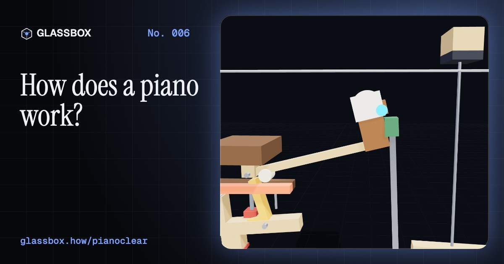
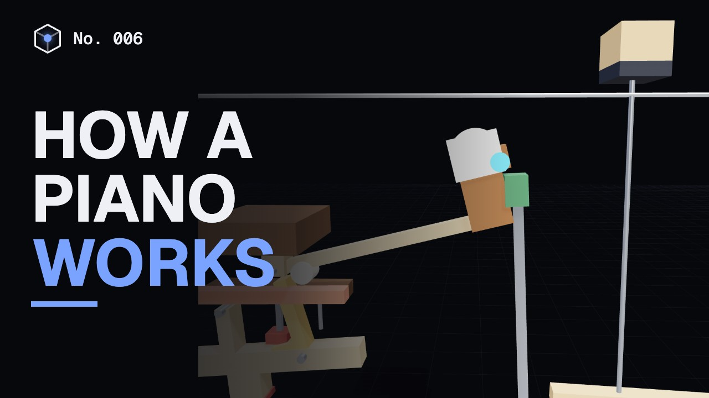
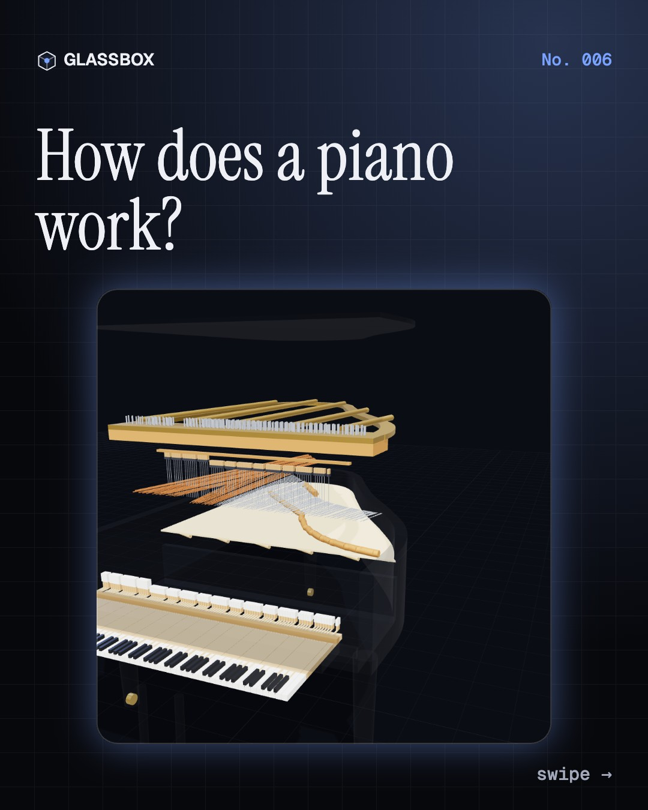
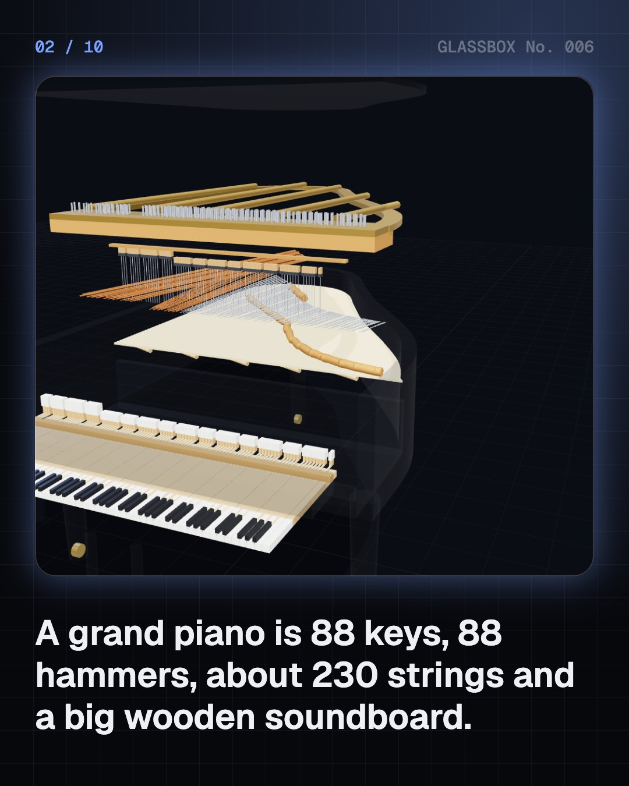
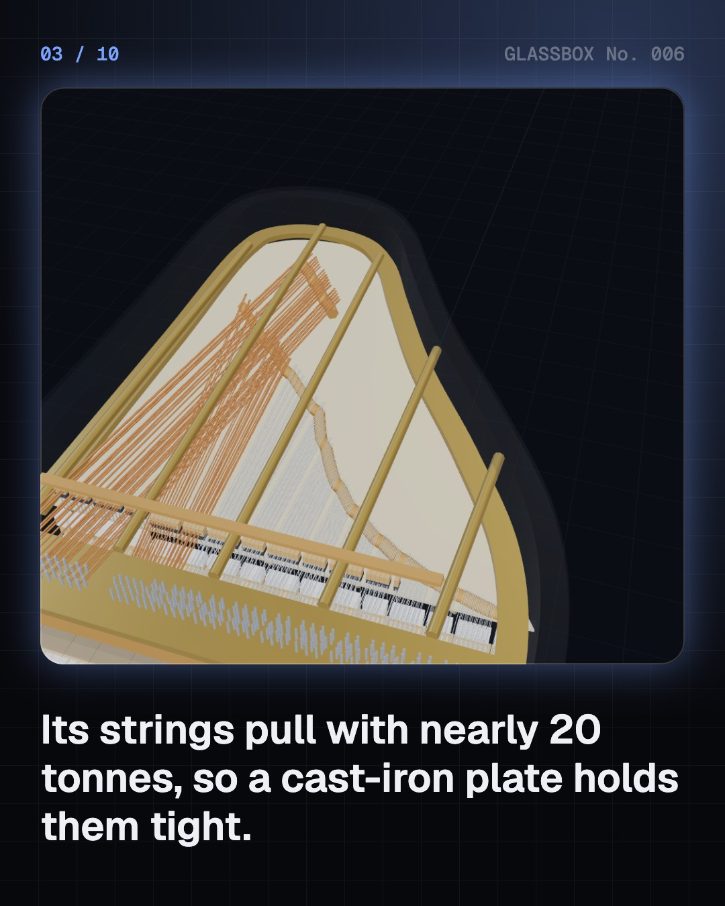
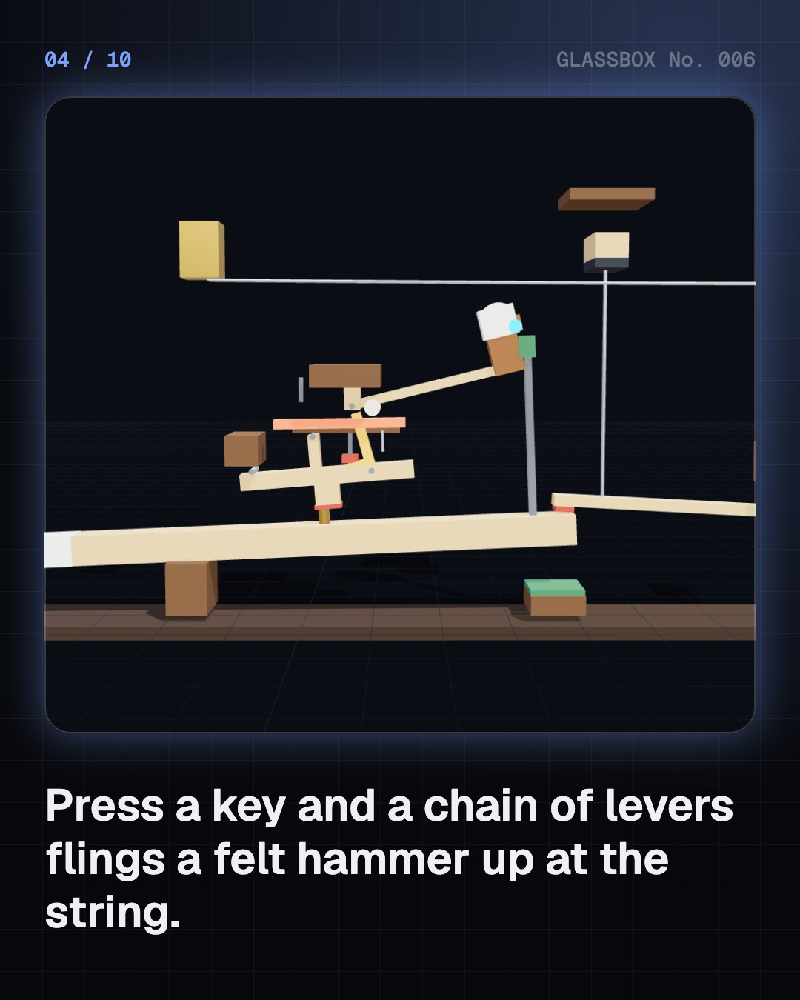

<!-- glassbox:start -->
<!-- Generated from glassbox.json by the Glassbox hub (npm run readme -- pianoclear). Edit glassbox.json, not this block. -->
<p align="center"><a href="https://glassbox-production-fd52.up.railway.app/e/pianoclear/"></a></p>

<h1 align="center">PianoClear</h1>

<p align="center"><b>How does a piano work?</b><br>Press a key and a chain of levers flings a felt hammer at steel strings pulling with nearly 20 tonnes. Take a grand piano apart in 3D, slow the hammer down 50 times, and play it yourself.</p>

<p align="center"><a href="https://glassbox-production-fd52.up.railway.app/pianoclear/"><b>▶ Play with it</b></a> &nbsp;·&nbsp; <a href="https://glassbox-production-fd52.up.railway.app/e/pianoclear/">Read the 60-second explainer</a> &nbsp;·&nbsp; <a href="https://glassbox-production-fd52.up.railway.app/pianoclear/glassbox/reel.mp4">Watch the 40-second video</a></p>

<p align="center">
  <a href="https://glassbox-production-fd52.up.railway.app/e/pianoclear/"></a>
  <a href="https://glassbox-production-fd52.up.railway.app/e/pianoclear/"></a>
  <a href="LICENSE"></a>
  <a href="LICENSE-CONTENT.md"></a>
  <a href="#privacy"></a>
</p>

## In 60 seconds

1. **Hammers, strings and a wooden board.** A piano is a string instrument played with hammers. Each of its 88 keys throws a felt hammer at one, two or three steel strings. About 230 strings pull with nearly 20 tonnes in total, so they are stretched across a cast-iron plate, above a thin spruce soundboard.
2. **A chain of levers that lets go.** The key lifts a lever called the wippen, which pushes the hammer up through a jack. Just before the hammer reaches the string, the jack trips on a button and slips away, so the hammer flies free, hits and bounces back. Érard's repetition lever of 1821 lets a note repeat before the key has fully risen.
3. **Length, tension and weight set the note.** A string's frequency is f = (1/2L)·√(T/μ): halve the length for one octave up, or pull four times as hard. It also vibrates in halves, thirds and quarters at once, and those overtones shape the sound. Stiff steel makes them slightly sharp.
4. **The soundboard makes it loud.** A string is too thin to push much air, so on its own it is nearly silent. It presses on a bridge glued to the soundboard, and the board, over a square metre of spruce, pumps the air. The trade-off: a louder note also fades sooner.
5. **88 keys, each 1.0595 times the last.** From A0 at 27.5 Hz to C8 at 4,186 Hz, with A4 tuned to 440 Hz. In equal temperament every semitone is the twelfth root of 2, so twelve steps make exactly one octave. Tuners stretch the octaves a little to match the strings' sharp overtones.
6. **Soft, loud, and three pedals.** Press faster and the hammer flies faster: louder, and brighter because the felt touches the string for less time. The right pedal lifts every damper, the left shifts the hammers onto fewer strings, and the middle one holds up only the dampers already raised.

## Words worth knowing

| Term | Meaning |
|---|---|
| **Action** | The set of levers between a key and its hammer and damper. A grand piano has 88 of them. |
| **Escapement** | The jack slipping out from under the hammer just before it hits, so the hammer flies free and bounces off the string. |
| **Damper** | A felt pad resting on a note's strings that stops them ringing when the key is let go. |
| **Overtone** | A higher vibration of a string in 2, 3, 4 or more parts, sounding along with the main note. |
| **Soundboard** | A thin, wide sheet of spruce under the strings that turns their vibration into sound. |
| **Equal temperament** | Tuning in which every semitone is the same ratio, the twelfth root of 2, so twelve make an octave. |
| **Unison** | Two or three strings tuned to the same note and struck together by one hammer. |
| **Sustain pedal** | The right pedal, which lifts every damper so notes keep ringing and other strings resonate. |

## A short history

**2,500 years from one plucked string to the grand piano, the player piano and the digital keyboard.**

- **530 BCE** · One string, many notes (Pythagoras (attributed), Ancient Greece)
- **1700** · A harpsichord that plays soft and loud (Bartolomeo Cristofori, Florence, Italy)
- **1711** · The piano's first diagram (Scipione Maffei, Venice, Italy)
- **1777** · Mozart loves Stein's escapement (Johann Andreas Stein and W.A. Mozart, Augsburg, Germany)
- **1817** · Beethoven's pianos (Ludwig van Beethoven, Érard and Broadwood, Paris, London and Vienna)
- **1821** · The double escapement (Sébastien and Pierre Érard, London, England, and Paris, France)
- **1825** · A frame of cast iron (Alpheus Babcock, Boston, USA)
- **1859** · Crossed strings (Henry Steinway Jr., Steinway & Sons, New York, USA)

The full story, with 30 moments, charts, people and 58 sources: [glassbox.how/e/pianoclear/history](https://glassbox-production-fd52.up.railway.app/e/pianoclear/history/). The data lives in [`history.json`](history.json).

## Video and slides

Made with the Glassbox studio from this box's storyboard (`window.glassbox.director`). Free to reuse under CC BY 4.0.

<a href="https://glassbox-production-fd52.up.railway.app/pianoclear/glassbox/video.mp4"></a>

<p><a href="glassbox/slide-1.jpg"></a> <a href="glassbox/slide-2.jpg"></a> <a href="glassbox/slide-3.jpg"></a> <a href="glassbox/slide-4.jpg"></a></p>

| File | What | Size |
|---|---|---|
| [`glassbox/reel.mp4`](https://glassbox-production-fd52.up.railway.app/pianoclear/glassbox/reel.mp4) | Reel / Short, with captions and soundtrack | 1080×1920 |
| [`glassbox/video.mp4`](https://glassbox-production-fd52.up.railway.app/pianoclear/glassbox/video.mp4) | YouTube video, with captions and soundtrack | 1920×1080 |
| `glassbox/slide-1…10.jpg` | Instagram carousel | 1080×1350 |
| `glassbox/thumb.jpg` | YouTube thumbnail | 1280×720 |
| `glassbox/cover.jpg` | Share card and repo social preview | 1200×630 |
| [`glassbox/history-reel.mp4`](https://glassbox-production-fd52.up.railway.app/pianoclear/glassbox/history-reel.mp4) | “History in 10 moments” Reel / Short | 1080×1920 |
| `glassbox/history-slide-*.jpg` | History carousel | 1080×1350 |
| `glassbox/post.json` | Post copy and schedule used by the publish kit | |

## Privacy

This box has no accounts and no ads, and it ships its own fonts and libraries. When you run it yourself it sends nothing anywhere. On glassbox.how, the site's `/bar.js` also loads Glassbox's analytics: **Google Analytics** to count visits (it asks first in the EU, UK and Switzerland, and stays off when your browser sends Global Privacy Control or Do Not Track) and **ClickTrust** to detect bots.

It remembers a few things **in your own browser only**, and never sends them anywhere:

| Browser storage key | What it holds |
|---|---|
| `pianoclear.v1` | Which chapters you have opened, your best quiz scores, and sound on or off. |

Exactly what each one sees is at [glassbox.how/privacy](https://glassbox-production-fd52.up.railway.app/privacy/).

## Licences

- **Code:** [MIT](LICENSE). Use it, change it, ship it.
- **Explanations, text, images and videos** (`glassbox.json`, `glassbox/`): [CC BY 4.0](LICENSE-CONTENT.md). Credit “Glassbox, glassbox.how/e/pianoclear”.
- **Third-party parts** keep their own licences: [three.js](https://threejs.org) (MIT), [Geist, Instrument Serif](https://openfontlicense.org) (SIL OFL 1.1).
- The Glassbox name and logo aren't covered by either licence. See the [terms](https://glassbox-production-fd52.up.railway.app/terms/).

Found a mistake? [Open an issue](https://github.com/bdeeps/pianoclear/issues). Corrections happen in public.
<!-- glassbox:end -->

## Run it

It's plain HTML, CSS and JavaScript. No build step and no dependencies. Run locally, it contacts no other website.

```bash
python3 -m http.server 8000
```

Three.js and the fonts ship in `vendor/` and `fonts/`, so it also works offline.

Then open http://localhost:8000.

## How it's built

| File | What |
|---|---|
| `index.html`, `css/app.css` | The page and its styles |
| `js/app.js`, `js/stage.js`, `js/ui.js`, `js/kit.js` | The shared Glassbox 3D engine: chapters, 3D stage, controls, quiz, video director |
| `js/chapters/*.js` | One file per chapter: the 3D model, controls, text, key terms, quiz and video scenes |
| `js/piano.js` | PianoClear's shared parts: note maths, the string scale, the WebAudio piano synth, keys and the 3D grand piano |
| `glassbox.json` | Title, question, explainer beats, key terms, browser storage and credits shown on glassbox.how |
| `reel` in each chapter | The storyboard the Glassbox studio records into short videos |
| `glassbox/` | The published video, slides, thumbnail and post copy |
| `fonts/`, `vendor/three/` | Self-hosted Geist and Instrument Serif (SIL OFL 1.1) and three.js (MIT) |
